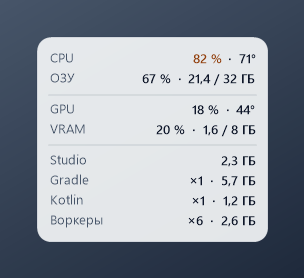
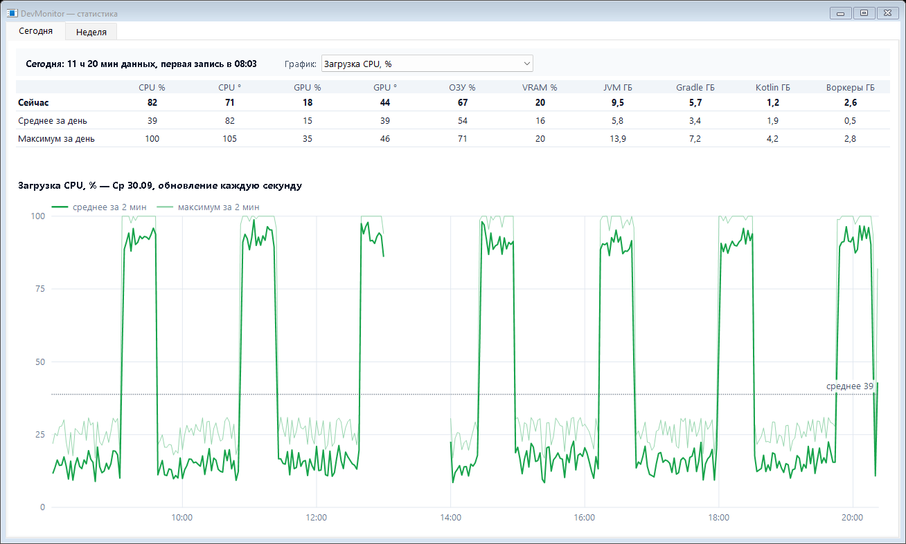
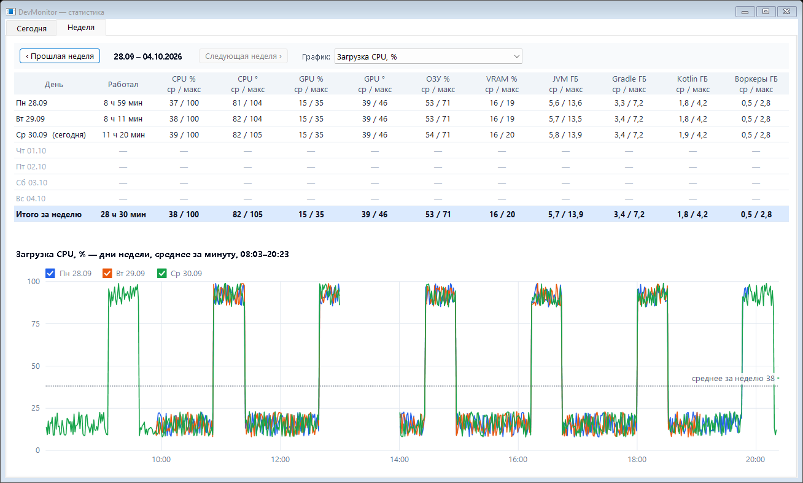
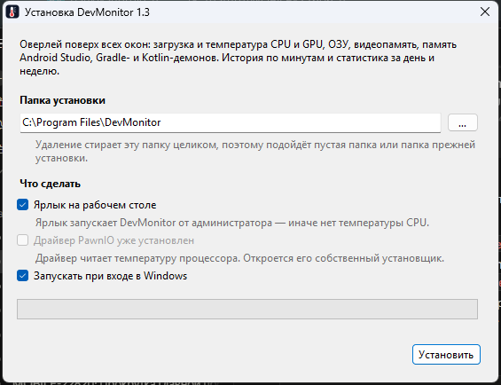

# DevMonitor

Маленький оверлей поверх всех окон: загрузка и температура CPU/GPU, ОЗУ, видеопамять,
память Android Studio и Java-процессов. Обновление раз в секунду. Без рамки, без панели задач,
без Alt+Tab. Плюс история по минутам и статистика за день и неделю — видно, сколько на самом деле
съедают Gradle и Kotlin-демоны при заданном `-Xmx`.

**Актуальная версия** — на странице [Releases](../../releases/latest), что изменилось — в [истории версий](CHANGELOG.md).



| Сегодня | Неделя |
|---|---|
|  |  |

Модель процессора и видеокарты определяется сама; пороги цвета температуры берутся из справочника
`hardware.csv` (144 модели Intel, AMD и NVIDIA за последние 5 лет).

## Установка

1. Скачай `DevMonitorSetup.exe` (~5 МБ) со страницы [последней версии](../../releases/latest),
   запусти и подтверди окно UAC.
2. Проверь папку установки (по умолчанию `C:\Program Files\DevMonitor`) и галочки:
   - **ярлык на рабочем столе** — запускает DevMonitor от администратора, иначе нет температуры CPU;
   - **драйвер PawnIO** — читает температуру CPU, откроется его собственный установщик (подписан
     namazso, тот же файл ставит `winget install namazso.PawnIO`); уже стоит — галочка неактивна;
   - **запускать при входе в Windows**.
3. Нажми «Установить». Программа запустится, в трее появится значок-термометр.



Программа лежит в папке установки (менять её может только администратор: DevMonitor работает с
правами, поэтому exe не должен лежать там, где его перезапишет обычная программа). История,
настройки и позиция окна — в `%LOCALAPPDATA%\DevMonitor` (`data\`, `settings.txt`, `position.txt`; при падении — `crash.log` с текстом ошибки).
Ставится только то, что нужно для работы: программа, `lib\`, справочник `hardware.csv`, README,
история версий, лицензии и установщик драйвера PawnIO.

## Отчёты о сбоях

В установщике есть галочка «Отправлять автору отчёты о сбоях», по умолчанию она **выключена**.

- **Что уходит.** Версия программы, Windows и .NET, текст ошибки со стеком вызовов и журнал падений
  `%LOCALAPPDATA%\DevMonitor\crash.log`. В сообщениях об ошибках могут быть пути к файлам с именем
  пользователя Windows. История показателей и настройки не отправляются. Сервер записывает IP-адрес,
  с которого пришёл отчёт.
- **При каких сбоях.** Программа упала.
- **Куда.** `https://aokazantsev.ru/pets/devmonitor/crash-report`, сервер в России. Отчёты видит только автор,
  хранятся последние 50 МБ — при поступлении новых самые старые удаляются. Подробности — в
  [политике обработки данных](https://aokazantsev.ru/privacy).
- **Когда.** Один раз при сбое, без повторных попыток. Не ушло — в журнал пишется «отчёт о сбое не
  отправлен» с причиной.
- **Как изменить выбор.** Переустановить программу с галочкой или без неё. Деинсталлятор удаляет
  согласие вместе с остальными данными.

## Удаление

«Параметры → Приложения → DevMonitor → Удалить» или `Uninstall.exe` в папке программы. Программа
закрывается сама; удаляются программа, история и настройки, ярлык, автозапуск и запись в
«Приложениях». Драйвер PawnIO остаётся — это отдельная программа, удаляется там же в «Приложениях».

## Цикл использования

1. Включил компьютер — драйвер PawnIO поднимается сам (корневое PnP-устройство, делать ничего не надо).
2. Нужен мониторинг — ярлык `DevMonitor` на рабочем столе → «Да» в окне UAC.
3. Не нужен — значок в трее → правая кнопка → «Выход».

Автозапуск включается галочкой «Запускать при входе в Windows» в установщике (по умолчанию стоит),
потом переключается в трее тем же пунктом. Это задача Планировщика заданий «DevMonitor»: при входе пользователя,
с наивысшими правами (температура CPU есть, окна UAC при входе нет), через 20 с после входа,
запускается и от батареи, без ограничения времени работы, вторую копию не запускает. Папка
«Автозагрузка» и ключ Run не годятся: они не поднимают права. DevMonitor, запущенный с ярлыка,
создаёт задачу без UAC; запущенный без прав — попросит UAC один раз. Удаление DevMonitor
убирает и задачу. Код — `src/Autostart.cs`.

**Трей.** Пока DevMonitor запущен, в области уведомлений всегда висит значок-термометр.
- Одиночный клик левой кнопкой — свернуть оверлей в трей или развернуть обратно.
- Правая кнопка — меню: «Свернуть в трей» / «Развернуть», «Статистика…»; «Настройки…»,
  «Запускать при входе в Windows», «О приложении…»; «Выход».
  Меню есть только на значке; по самому оверлею правая кнопка ничего не делает.
- Подсказка на значке — первая строка каждой группы (CPU, GPU, Studio) текущими значениями.
  Строка без значения (например, Studio, когда Android Studio закрыта) в подсказку не попадает.
- Свёрнутый оверлей не рисуется, но данные собираются и пишутся в историю как обычно.
- Windows 11 прячет новые значки под стрелку «^». Чтобы значок был виден всегда:
  Параметры → Персонализация → Панель задач → Другие значки в области уведомлений → DevMonitor.

- Перетащить оверлей — зажать левую кнопку мыши на окне. Позиция запоминается в `position.txt`.
- Повторный запуск второй копии не создаёт. Поэтому, если DevMonitor уже запущен без прав
  (через `DevMonitor.exe` напрямую или `build.cmd`), ярлык ничего не сделает, а температура CPU
  останется `—°`: сначала «Выход», потом ярлык.

## Что показывает

| Группа | Строка | Источник |
|---|---|---|
| 1 | CPU — загрузка % · температура | `GetSystemTimes` (как «% Processor Time»); температура — LibreHardwareMonitor, см. ниже |
| 1 | ОЗУ — % · занято / всего | `GlobalMemoryStatusEx` |
| 2 | GPU — загрузка % · температура | NVML (`nvml.dll` из драйвера NVIDIA), без прав администратора |
| 2 | VRAM — % · занято / всего | NVML |
| 3 | Studio — память `studio64.exe` | список процессов, раз в 3 с |
| 3 | Gradle — число Gradle-демонов · их память | `java.exe` с `GradleDaemon` в командной строке |
| 3 | Kotlin — число Kotlin-демонов · их память | `java.exe` с `KotlinCompileDaemon` |
| 3 | Воркеры — остальные `java.exe` · их память | воркеры тестов, клиент `gradlew`, прочие JVM |

Командная строка `java.exe` читается напрямую (`NtQueryInformationProcess`, без WMI) один раз на
процесс и кэшируется по PID. Больше одного Gradle-демона — счётчик янтарный: скорее всего висит
демон от старой сборки или другой JDK. Воркеры живут только во время сборки: не пропадают после
неё — сборка ещё идёт или зависла.

**Ноутбук на батарее.** Пока питание от батареи, видеокарта не опрашивается вовсе: на ноутбуках с
переключаемой графикой ежесекундный опрос не даёт дискретной карте уснуть и сажает батарею. Строка
GPU показывает «пауза: батарея», VRAM — «—», в историю по GPU на это время ничего не пишется
(на графиках разрыв). Подключил зарядку — опрос возобновляется со следующей секунды. CPU, ОЗУ и
процессы читаются как обычно. Источник питания — `src/PowerSource.cs`, решение — `src/MetricsCollector.cs`.

## Цвета

Загрузка и температура красятся **независимо**: 99 % загрузки не делает температуру красной.

| Значение | Янтарный | Красный |
|---|---|---|
| Загрузка CPU / GPU, ОЗУ, VRAM | от 75 % | от 90 % |
| Температура CPU и GPU | по выбранной модели | по выбранной модели |

Пороги загрузки — `src/MetricRowsFormatter.cs`. Пороги температуры — из справочника железа, см. ниже.

## Железо и настройки

**Справочник** — `hardware.csv` рядом с exe, по строке на модель:
`тип;модель;янтарный от;красный от;откуда цифры`. Сейчас 144 модели за последние 5 лет:
- настольные: Intel Core 12–14-го поколений и Core Ultra 200S, AMD Ryzen 5000 / 7000 / 8000G / 9000,
  NVIDIA GeForce RTX 30 / 40 / 50;
- ноутбуки: Intel Core 12–13-го H/HX, 14-го HX, Core Ultra серии 1 H, серии 2 H / HX / V,
  NVIDIA GeForce RTX 30 / 40 / 50 Laptop GPU.

Правила порогов:
- CPU: янтарный = TjMax − 15, красный = TjMax − 5 (TjMax — предел производителя, на нём троттлинг).
- NVIDIA: красный = максимум по спецификации − 3; янтарный = 83, но не выше красного − 4
  (83 °C — распространённая цель GPU Boost, в спецификациях NVIDIA её нет).
- NVIDIA Laptop: максимум NVIDIA не публикует — его задаёт производитель ноутбука. В справочнике
  у них `auto;auto`: при запуске DevMonitor спрашивает у драйвера «Max Operating Temp» и
  «Target Temperature» этого ноутбука и считает по тому же правилу (целевая вместо 83). Драйвер не
  ответил — пороги по умолчанию 83/87. На RTX 3070 драйвер отдаёт 93 и 83 — ровно как в спецификации.

Все пределы сверены с сайтами производителей 24.09.2026: Intel ARK (через intel.cn — intel.com из РФ
не открывается), amd.com, nvidia.com. Мобильные Intel: 12–14 H/HX — 100 °C, Core Ultra H (серии 1 и 2) —
110 °C, 200HX — 105 °C, 200V — 100 °C. Поправлены i9-12900KS (90 °C, не 100) и RTX 50 (у каждой модели
свой максимум: 5050 — 87, 5060 — 89, 5060 Ti — 87, 5070 — 85, 5070 Ti и 5080 — 88, 5090 — 90).

В справочнике **только поддерживаемое**. CPU — проверено по исходникам: LibreHardwareMonitor 0.9.6
(`IntelCpu.cs`) создаёт датчики температуры только для известных ему моделей CPUID — Alder, Raptor,
Meteor, Arrow (кроме Arrow Lake-U) и Lunar Lake, у AMD — Zen 3/4/5; модуль PawnIO IntelMSR моделей
не ограничивает и разрешает читать регистры температуры (0x19C, 0x1B1, 0x1A2). Core Ultra 200U
(Arrow Lake-U) LHM не распознаёт — их в списке нет. GPU — только NVIDIA, температура из драйвера
NVIDIA; AMD Radeon и Intel Arc DevMonitor не читает.

**Настройки** — трей → «Настройки»: два списка (процессор, видеокарта), под каждым — пороги
выбранной модели и что Windows видит в этом ПК. «Сохранить» пишет `settings.txt`
(`cpu=…`, `gpu=…`). Выбор читается **только при запуске** — новый вступает в силу после
перезапуска (трей → «Выход», затем ярлык). Меняются только цвета температуры на оверлее и
пунктиры зон на графиках; история и остальное не затрагиваются. Нет `settings.txt` — модель берётся
та, что Windows видит в этом ПК (`src/HardwareMatcher.cs` сопоставляет её со справочником); модели нет
в справочнике — пороги по умолчанию (CPU 85/95, GPU 83/87).

## История и статистика

**Запись.** Каждую секунду значения копятся в памяти, раз в минуту на диск дописывается одна
строка — среднее и максимум за эту минуту. Файл на день: `%LOCALAPPDATA%\DevMonitor\data\ГГГГ-ММ-ДД.csv`
(~1440 строк, ~150 КБ). Пишется только пока DevMonitor запущен; при «Выходе» дописывается
незаконченная минута. Колонки: `time`, затем `<показатель>_avg`, `<показатель>_max` для
`cpu_load`, `cpu_temp`, `gpu_load`, `gpu_temp`, `ram`, `vram`, `jvm_gb` (Gradle + Kotlin + воркеры),
`gradle_gb`, `kotlin_gb`, `workers_gb` (то же по отдельности: видно, сколько реально занимает каждый
демон при заданном `-Xmx`). Нет значения (например, температура CPU без прав) — пустая ячейка.

Файл читается **по заголовку**, а не по номеру колонки: файлы с прежним набором колонок читаются,
недостающие показатели в них пустые. Если заголовок сегодняшнего файла не совпадает с текущим,
при первой записи файл переписывается под новый заголовок, старые значения сохраняются.

**Очистка.** Только при запуске. Хранится текущая (неполная) неделя и две предыдущие полные —
от 15 до 21 дня: всё раньше понедельника позапрошлой недели удаляется
(`HistoryStore.RetainedFullWeeks`).

**Окно.** Значок в трее → правая кнопка → «Статистика» — отдельное окно (повторный вызов
поднимает уже открытое). Две вкладки:

- **Сегодня** (открывается первой) — обновляется каждую секунду: значения «сейчас /
  среднее за день / максимум за день», сколько сегодня есть данных и во сколько первая
  запись, график выбранного показателя по минутам. Сегодняшние записи держатся в памяти —
  секундное обновление диск не читает.
- **Неделя** — понедельник–воскресенье, «Прошлая / Следующая неделя» (листается в пределах
  хранимых недель). Таблица по дням: сколько работал DevMonitor и «среднее / максимум» по
  каждому показателю, последняя строка — итог. Строка «Итого» — дни недели наложены
  друг на друга на одной оси времени суток: до 7 линий, по одной на день с данными, каждая —
  среднее за минуту, у каждого дня свой цвет (Пн синий, Вт оранжевый, Ср зелёный, Чт фиолетовый,
  Пт розовый, Сб бирюзовый, Вс коричневый — цвет закреплён за днём недели, толщина у всех
  одинаковая). Дни в легенде — галочки: снял — линия скрыта, «среднее за неделю» считается
  только по показанным дням. По умолчанию включены все; выбор привязан к дню недели и живёт,
  пока запущен DevMonitor (переживает закрытие окна, не переживает перезапуск). Строка дня
  в таблице — этот день подробно (среднее и максимум).
  Перечитывается раз в минуту.

**Оси графиков — обе в едином масштабе на всю хранимую историю,** поэтому любые два
графика сравниваются на глаз.
- Время: общее окно суток — от самой ранней первой записи до самой поздней последней среди
  всех хранимых дней (например, 08:03–19:52). В нём рисуется «Сегодня», каждый день и каждый
  день на недельном графике — пустоты до включения и после выключения ПК обрезаны, разрывы
  внутри окна (обед, выключенный ПК) остаются. На недельном графике все дни лежат на этой
  же оси, дни без данных в легенду не попадают. Окно в заголовке недельного графика. Шаг
  точек на графике дня подбирается под длину окна (не больше ~480 точек), на недельном —
  всегда минута.
- Значение: верх по максимуму показателя за всю историю, округлён вверх (проценты и
  градусы — до 20, JVM — до 2 ГБ; проценты не выше 100): где линия выше, там значение больше.

Окно и максимумы считаются один раз при первом открытии статистики и дальше обновляются
каждую минуту вместе с записью.

На графике дня («Сегодня» и день из недели) линия среднего — цвета дня недели, линия
максимума — тот же цвет, осветлённый на 55 %. Точечная — среднее за период,
пунктиры на температурах — янтарная и красная зоны (если попадают в масштаб).

## Температура CPU

Windows не отдаёт температуру CPU обычным программам: датчик читается только драйвером ядра.
Без него в строке CPU стоит `—°`. Нужны три вещи:

1. **Библиотека** — `lib\`: LibreHardwareMonitorLib 0.9.6 (MPL-2.0, NuGet, сборка `net472` x64)
   и её зависимости. Уже лежит. Нет папки — программа работает без температуры CPU.
2. **Драйвер PawnIO** — через него LibreHardwareMonitor с версии 0.9.5 читает датчики
   (старый WinRing0 убран, на него ругался Defender). Ставится один раз:

   ```
   winget install namazso.PawnIO
   ```

3. **Права администратора** — без них драйвер недоступен. Ярлык на рабочем столе помечен
   «Запуск от имени администратора». Автозапуск без окна UAC — задача планировщика
   (папка «Автозагрузка» права не повышает):

   ```
   schtasks /create /tn DevMonitor /tr "D:\DevMonitor\DevMonitor.exe" /sc onlogon /rl highest
   ```

Датчик берётся по приоритету: `CPU Package` → `Core Max` → `Core Average`
(`src/CpuTemperatureSensor.cs`). Обновить библиотеку — заменить содержимое `lib\` DLL-ками
из пакетов NuGet (`runtimes/win-x64/lib/net472` или `lib/net4xx`).

## Расход ресурсов

Замер с температурой CPU и записью истории: ~0,5 с процессорного времени за минуту
(≈0,04 % CPU), ~54 МБ private (рантайм .NET и WinForms), приоритет процесса ниже обычного. Что для этого сделано:

- CPU — `GetSystemTimes` вместо PerformanceCounter (тот читает всю категорию счётчиков).
- Список процессов — один проход раз в 3 с, а не по имени на каждую строку.
- Кисти, шрифты, битмап созданы один раз; окно перерисовывается, только если текст изменился.
- Фоновый GC отключён (`DevMonitor.exe.config`), лишнего потока нет.
- История — одна запись на диск в минуту; окно статистики создаётся только по клику и
  освобождается при закрытии.

## Сборка

Нужен только .NET Framework 4.8 (есть в любой Windows 10/11), SDK не требуется.

- `build.cmd` — программа (`DevMonitor.exe`).
- `build-installer.cmd` — программа, `Uninstall.exe`, архив `installer\obj\payload.zip` (состав —
  `installer\payload.txt`) и установщик `dist\DevMonitorSetup.exe`. Установщик драйвера PawnIO в git
  не хранится: скрипт `installer\fetch-pawnio.ps1` скачивает его с GitHub (namazso/PawnIO.Setup) и
  сверяет SHA-256.
- Скриншоты для README — `docs\*.png`. Поменял интерфейс — переснять.
- Для Claude — `CLAUDE.md`: правила сборки, проверки и грабли.

```
build.cmd
```

Скрипт компилирует `src\*.cs` штатным `csc.exe` (C# 5 — без `$"..."`, `?.`, `nameof`), кладёт
`DevMonitor.exe` и `.config` рядом и запускает. Установленную копию он не трогает; если занят exe
в папке сборки — переименовывает его в `DevMonitor.old.exe`.
`build.cmd nostart` — только собрать.

## Где что менять

| Хочу | Файл |
|---|---|
| Состав строк и групп, формат, пороги | `src/MetricRowsFormatter.cs` (`GroupSizes` должен совпадать с группами в `Format`) |
| Цвета, размеры, шрифт, скругление, отступы | константы в начале `src/OverlayForm.cs` |
| Меню трея, клик по значку, подсказка | `ConfigureTrayIcon`, `BuildMenu`, `UpdateTrayText` в `src/OverlayForm.cs` |
| Частоту обновления | `RefreshIntervalMs` в `src/OverlayForm.cs` |
| Как часто опрашиваются процессы | `ProcessRefreshTicks` в `src/MetricsCollector.cs` |
| Как делятся `java.exe` на Gradle / Kotlin / воркеры | `src/JavaProcessClassifier.cs` |
| Пороги температуры, новая модель железа | `hardware.csv` (выбор — трей → «Настройки»); `auto;auto` — пороги из драйвера NVIDIA (`src/DriverZones.cs`) |
| Установщик: тексты, галочки, шаги | `installer\setup\SetupProfile.cs`; окно и общий сценарий — `SetupForm.cs`, `Installation.cs` (общие для всех pet-проектов) |
| Удаление | `installer\uninstall\UninstallProfile.cs`; общий сценарий — `UninstallProgram.cs`, ярлык и запись в «Приложениях» — `installer\common\` |
| Окно настроек | `src/SettingsForm.cs`; чтение справочника — `src/HardwareCatalog.cs`, выбор при запуске — `src/ActiveHardware.cs` |
| Что пишется в историю | `src/MetricKind.cs` + `src/MetricCatalog.cs` + `src/MetricSampler.cs`; новый показатель — в конец `MetricKind` и `MetricCatalog.All` (порядок совпадает с индексами); старые файлы читаются по заголовку, `data\` удалять не нужно |
| Срок хранения истории | `RetainedFullWeeks` в `src/HistoryStore.cs` |
| Окно статистики: вкладки, таблицы | `src/StatisticsForm.cs`, `src/TodayView.cs`, `src/WeekView.cs`, стиль — `src/StatisticsStyle.cs` |
| График: обрезка времени, шаги, цвета | `src/HistoryChart.cs`; шаг масштаба — `ScaleMax` в `src/MetricCatalog.cs` |
| Новый датчик | новый класс-сенсор + поле в `MetricsSnapshot` + строка в `MetricRowsFormatter` |
| Позицию по умолчанию | `src/WindowPositionStore.cs` (правый верхний угол, отступ 16 px); сбросить — удалить `position.txt` |

## Палитра

Светлая подложка почти непрозрачная (альфа 232 из 255), текст тёмный. Полупрозрачный фон с белым
текстом не читается на светлых окнах: контраст зависит от того, что под окном. При непрозрачности
~90 % тёмный текст держит контраст выше 4,5:1 (порог WCAG AA) на любом фоне под окном.

| Роль | Цвет |
|---|---|
| Фон | `#F6F8FB`, альфа 232 |
| Подпись | `#475569` |
| Значение | `#0F172A` |
| Предупреждение | `#92400E` |
| Критично | `#B91C1C` |
| Разделитель / рамка | `#0F172A`, альфа 36 / 40 |

## Иконка

Термометр, `src/app.ico` (16–256 px), вшивается в exe при сборке (`/win32icon`), ярлык берёт её
из exe. Перерисовать — поправить `src/make_icon.py` (Pillow) и запустить, затем `build.cmd`.

## Устройство

Окно — layered window (`UpdateLayeredWindow`): картинка с альфа-каналом рисуется в битмап и
отдаётся системе целиком, поэтому скруглённые углы и прозрачность настоящие, без `TransparencyKey`.

## Лицензия

MIT — см. [LICENSE](LICENSE). Сторонние библиотеки в `lib\` и драйвер PawnIO — под своими лицензиями,
см. [THIRD_PARTY_NOTICES.md](THIRD_PARTY_NOTICES.md).
